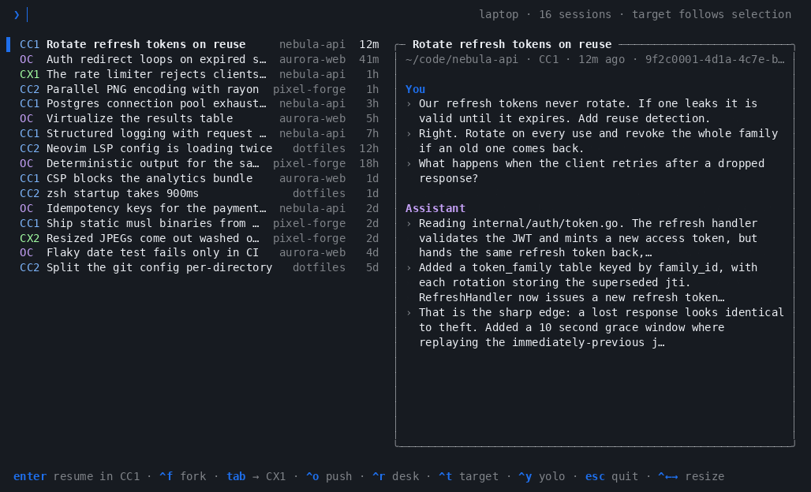
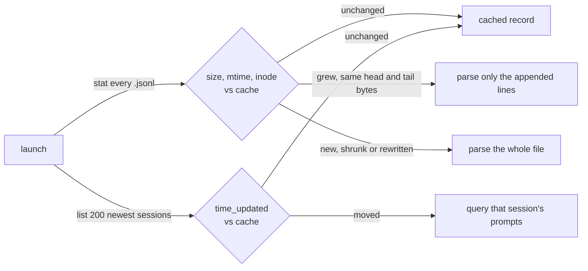

<h1 align="center">AgentBridge</h1>

<p align="center">
  <b>Your sessions and shared agent setup, in one place.</b><br>
  Search every OpenCode, Claude Code and Codex account, carry conversations across tools and machines, and synchronize skills and MCPs.
</p>

<p align="center">
  <a href="https://github.com/sergio-gimenez/opencode-sessions/actions/workflows/ci.yml"></a>
  <a href="LICENSE"></a>
  =1.23" src="https://img.shields.io/badge/go-%3E%3D1.23-00ADD8.svg">
  
</p>

<p align="center">
  
</p>

<p align="center"><sub>The demo runs against synthetic sessions; see <a href="demo/README.md">demo/</a>.</sub></p>

## Why

Your work is spread across three tools and however many accounts you signed into.
Finding the session where you actually solved something means remembering which
tool you were in, `cd`-ing to the right repo, then paging through a separate
resume list for every tool and every account.

AgentBridge (`agb`) reads those stores directly and puts everything in one
list, newest first, searchable by the words you typed rather than only the
title a tool gave it.

It also moves a session between your machines: push it to an always-on box
before you leave, follow it from your phone, and pull it back later as the same
session. See [pushing and pulling](#pushing-and-pulling-a-session-between-machines).

`agb` also shares local skills and MCP definitions across tools and accounts
through user-defined profiles. Start with `agb setup --example`, review with
`agb plan`, and apply with `agb sync`. See [sharing agent setup](docs/setup.md)
and the [broader product design](docs/shared-agent-setup.md).

## Install

Needs Go 1.23+ to build, and at least one of OpenCode, Claude Code and Codex.
The result is a single static binary with no runtime to install.

```bash
git clone https://github.com/sergio-gimenez/opencode-sessions.git
cd opencode-sessions
make install              # puts `agb` in ~/.local/bin, no root needed
```

Then:

```bash
agb
```

Upgrades use `~/.config/agentbridge`, `~/.cache/agentbridge`, and `AGB_*`.
Move any existing configuration or cache into those directories before removing
an older installation. Running `make install` removes obsolete command aliases.

## Try it without touching your own sessions

```bash
make demo
```

That builds a synthetic history (two Claude accounts, two Codex accounts, an
OpenCode store, four invented projects) and runs the real picker against it with
opening stubbed out. A second fake machine, "desk", is there to try `Ctrl+O`
(push) and `Ctrl+R` (browse and pull) on. Nothing of yours is read and nothing
gets launched. Details in [`demo/README.md`](demo/README.md).

## Keys

| Key | What it does |
| --- | --- |
| type | Filter by title, directory and your prompts |
| `↑` `↓` | Move the selection |
| `PgUp` `PgDn` `Home` `End` | Jump |
| `Enter` | Follow the displayed route |
| `Ctrl+F` | Fork: follow the same route, but branch into a new session |
| `Ctrl+T` | Cycle the target forwards: OpenCode → each Claude account → each Codex account |
| `Shift+Tab` | Cycle the target backwards |
| `Tab` | Open in the *next tool* right away, as a transcript-seeded fork |
| `Ctrl+Y` | Toggle yolo: bypass permission checks for this launch only |
| `Ctrl+O` | Push the session to another machine ([push and pull](docs/push-pull.md)) |
| `Ctrl+R` | Browse another machine's sessions; `Enter` there pulls one and resumes it here |
| `Ctrl+←` `Ctrl+→` | Move the divider between the list and the card; the width is remembered |
| `Esc` `Ctrl+C` | Cancel |

## Reading the list

Each row is one session: where it lives, its title, its project and how long
ago it was last touched. The card on the right shows the selected session's
directory, account and id, then your latest prompts and the assistant's latest
replies, with your search terms highlighted.

| Row starts with | Meaning |
| --- | --- |
| `OC` | An OpenCode session, resumed natively. |
| `CC1` | A Claude session owned by account `cc1`, resumed natively. |
| `CX1` | A Codex session owned by account `cx1`, resumed natively. |
| `CC1 →` | Enter carries it to the pinned target (shown in the header) as a seeded fork. The arrow takes the target tool's colour. |

Until you press `Ctrl+T` the target follows the selection, so rows show no
arrow and `Enter` resumes whatever you picked in the account it already belongs
to. Cycling pins a destination: the header shows `target CX2`, crossing rows get
an arrow, and the card spells out where `Enter` will open the session. The
footer always says what `Enter` and `Tab` will do, and a red `YOLO` in the
header means the launch will skip permission checks.

`Ctrl+←` and `Ctrl+→` move the divider between the list and the card, and the
next launch opens with the same split. On macOS those keys switch Spaces by
default; free them under System Settings → Keyboard → Keyboard Shortcuts →
Mission Control if you want them in the terminal. Below 90 columns the card is
hidden and the list takes the whole width.

## Forking a session

`Enter` continues the picked session, so new turns land in the original
conversation. `Ctrl+F` follows the same route but branches: you get a new session
to take in a different direction, and the original stays exactly as you left it.

Inside one tool and account the fork is native, so the copy carries real session
state rather than a retelling of it:

```
claude --resume <id> --fork-session
opencode --session <id> --fork
codex fork <id>
```

Ids don't survive a hop between tools or between accounts, so across one of those
both `Ctrl+F` and `Enter` fall back to the transcript-seeded path below. That
path is already a fork; the original never changes either way.

The right column previews the selected session: title, directory, id, your most
recent prompts, plus recent assistant replies when you pass `--assistant`. Search
terms light up in both columns.

## Migration is a fork, not a move

Cross-tool and cross-account opens do **not** migrate a session. Ids are not
portable between OpenCode, Claude Code and Codex, or between two accounts of the
same tool, so `agb` starts a **new** session in the target and pastes the old
transcript in as context. Consequences worth knowing:

- The original session still sits in its own tool, untouched.
- Ping-ponging (CC → CX → OC …) leaves a **chain of partial copies**, since every
  hop rebuilds state from a transcript instead of resuming the real thing.
- Fork from the **most recent** node, at the top of the list, or you carry a
  stale branch forward.

Do it deliberately, at a boundary that makes sense: a task is finished, you want
to keep the general context, and you'd rather continue in the other tool. `Tab`
is not a live round trip, so treat it as "start fresh over there, with this
history".

For long conversations, the handoff includes the opening request, the latest
user message, recent turns, and the latest readable compaction summary saved by
the source tool, when one exists. Code blocks and line breaks are preserved.
The opening prompt is limited to 60,000 bytes, including its metadata; this is
a CLI transport limit, not a model-specific token budget. Oversized messages
retain their beginning and end, with an explicit omission notice.

Every seeded fork saves an untruncated copy of the extracted user and assistant
text in `~/.cache/agentbridge/handoffs/`, beside the index cache, and gives the target
agent its absolute path. Turns are numbered so omitted details can be read in
ranges. The file also points to the source JSONL for tool outputs and attachments;
OpenCode's complete JSON export is saved alongside the readable transcript.
Files are private to your user, and later forks keep earlier snapshots valid.

`agb` reuses saved summaries rather than making a new model call. When history
is omitted from the prompt, it instructs the target agent to recover requirements
and decisions from the saved transcript before acting. Encrypted compaction
checkpoints cannot be reused as readable summaries across tools. Handoff files
remain until you remove them; deleting them removes that recovery path from
sessions that reference them. Dry runs also prepare these files.

## Pushing and pulling a session between machines


A Claude Code or Codex session lives on one machine at a time. `Ctrl+O` in the
picker (or `agb push desk ID`) hands it to another of your machines, and
`Ctrl+R` (or `agb pull desk ID`) browses that machine and brings one back. On
the other side it resumes as the same session, not as a seeded fork.

```
 laptop                                   desk
┌────────────┐   push  Ctrl+O  ───────►  ┌────────────┐
│ your list  │                           │ herdr tab  │──► phone
│            │   ◄───  Ctrl+R ↵  pull    │            │
└────────────┘                           └────────────┘
 stops only if it is open on either side, or the other copy is bigger
```

Neither is a sync. The copy being sent replaces the other one. Code travels
through git, so a dirty checkout gets a note, never a stop. An `arrive` hook per
host can start the session once it lands, for example in a
[herdr](https://herdr.dev) tab where your phone can follow it.

Setup, the checks, what travels, and troubleshooting:
**[docs/push-pull.md](docs/push-pull.md)**.

## Sharing memory between tools

A fork carries the conversation, not what the agent has saved to memory.
Claude Code keeps that in `~/.claude/projects/<project>/memory/`, and two
third-party plugins let the other tools use the same files.
`make install` suggests whichever ones you're missing.

- **OpenCode:** [`opencode-claude-memory`](https://github.com/kuitos/opencode-claude-memory)
  reads and writes the memory directory and respects `CLAUDE_CONFIG_DIR`. Add
  `"plugin": ["opencode-claude-memory"]` to `opencode.json`.
- **Codex:** [`codex-claude-memory-plugin`](https://github.com/gaboe/codex-claude-memory-plugin)
  loads the project's `MEMORY.md` when a session starts and writes to it only when you ask
  Codex to remember something. It is young and always reads `~/.claude`, so
  other Claude accounts' memory isn't picked up.

  ```bash
  codex plugin marketplace add gaboe/codex-claude-memory-plugin
  codex plugin add codex-claude-memory-plugin@codex-claude-memory
  ```

## Rendering diagrams in every tool

A forked session often carries a diagram with it. [`claude-mermaid`](https://github.com/veelenga/claude-mermaid)
is a single stdio MCP server that renders Mermaid and live-reloads a browser
preview, so all three tools can point at the same binary and a diagram looks the
same wherever the session lands. `make install` suggests it for the
tools that don't have it wired up yet.

```bash
npm install -g claude-mermaid
```

- **Claude Code:** `claude mcp add --scope user mermaid claude-mermaid`, or
  install the plugin with `/plugin marketplace add veelenga/claude-mermaid`.
- **OpenCode:** add the server to `opencode.json`.

  ```json
  "mcp": {
    "mermaid": { "type": "local", "command": ["claude-mermaid"], "enabled": true }
  }
  ```

- **Codex:** add the server to `~/.codex/config.toml`.

  ```toml
  [mcp_servers.mermaid]
  command = "claude-mermaid"
  ```

The repository also ships a `mermaid-diagrams` skill. It is written for Claude
Code, but the file drops into `~/.codex/skills/` and
`~/.config/opencode/skill/` as-is once you remove its `allowed-tools:` line,
which names Claude Code's tool ids. The preview opens a local browser tab, so it
is only useful for sessions running on your own machine.

For diagrams the agent should keep editing, [`mcp-excalidraw-server`](https://github.com/yctimlin/mcp_excalidraw)
gives every tool the same live Excalidraw canvas. The agent can draw on it, take
a screenshot, fix what it sees and export a `.excalidraw` file. It is again one
stdio binary, and it starts the canvas on `127.0.0.1:3000` by itself.

```bash
npm install -g mcp-excalidraw-server
```

- **Claude Code:** `claude mcp add --scope user excalidraw -- mcp-excalidraw-server`
- **OpenCode:** `"excalidraw": { "type": "local", "command": ["mcp-excalidraw-server"], "enabled": true }`
  under `"mcp"` in `opencode.json`.
- **Codex:** `codex mcp add excalidraw -- mcp-excalidraw-server`

Its skill has no tool ids in it, so one command installs it for each tool:

```bash
for root in ~/.claude/skills ~/.codex/skills ~/.config/opencode/skill; do
  mcp-excalidraw-server install-skill --dir "$root"
done
```

## Multiple accounts

Claude Code and Codex each keep credentials, config and session history under a
single home directory, which makes a second account nothing more than a second
home. Use each tool's normal home for the first account and an isolated one for
every account after that:

```bash
cc1() { command claude "$@"; }
cc2() { CLAUDE_CONFIG_DIR="$HOME/.claude-cc2" command claude "$@"; }

cx1() { command codex "$@"; }
cx2() { CODEX_HOME="$HOME/.codex-cx2" command codex "$@"; }
```

Authenticate each once (`cc2 auth login`, `cx2 login`), then tell `agb` about
them in `~/.config/agentbridge/config.json`:

```json
{
  "skipPermissions": false,
  "claudeAccounts": [
    { "name": "cc1" },
    { "name": "cc2", "configDir": "~/.claude-cc2" }
  ],
  "defaultClaudeAccount": "cc1",
  "codexAccounts": [
    { "name": "cx1" },
    { "name": "cx2", "codexHome": "~/.codex-cx2" }
  ],
  "defaultCodexAccount": "cx1"
}
```

Omit `configDir` or `codexHome` for the tool's normal default account. `agb` scans
each account's own store and remembers which account owns what, so a `cc1`
session resumes in `cc1` unless you deliberately retarget it.

Leave either block out and `agb` falls back to that tool's default home, labelling
it `[CC]` or `[CX]`.

Pick the starting target from the command line when that helps:

```bash
agb --target cx2            # any account name, or "oc" for OpenCode
agb --claude-account cc2    # the same thing, said the long way
agb --codex-account cx2
```

Full setup, verification and troubleshooting lives in
[Using multiple Claude Code accounts](docs/multiple-claude-accounts.md) and
[Using multiple Codex accounts](docs/multiple-codex-accounts.md).

## Permissions

Launch the target tool with permission checks bypassed
(`claude --dangerously-skip-permissions` / `opencode --auto` /
`codex --dangerously-bypass-approvals-and-sandbox`):

```bash
agb --dangerous     # also --skip-permissions / --yolo
agb --safe          # force checks back on, overriding the config default
```

To go yolo just once, press `Ctrl+Y` in the picker. The status line turns into a
red `YOLO` for the launch you are about to make; press it again to go back to
asking. Nothing is saved.

Defaults live in `~/.config/agentbridge/config.json`, globally or per agent:

```json
{
  "skipPermissions": false,
  "opencode": { "skipPermissions": true },
  "claudeAccounts": [
    { "name": "cc1" },
    { "name": "cc2", "configDir": "~/.claude-cc2", "skipPermissions": true }
  ],
  "codexAccounts": [{ "name": "cx1", "skipPermissions": true }]
}
```

What wins, strongest first:

```
Ctrl+Y in the picker  →  --yolo / --safe  →  the target's skipPermissions  →  global skipPermissions
```

The setting follows the *target*, not the session: forking a `cc1` session into
`cx1` uses `cx1`'s default.

> **Note**
> Skipping permission checks lets the agent act on your filesystem without
> prompting. Turn it on only for directories where you accept that.

## Command line

| Flag | Effect |
| --- | --- |
| `--print` | List the 25 most recent sessions and exit, no picker |
| `--query <text>` | Start the picker with a filter already applied |
| `--assistant` | Search assistant replies too, not just your prompts |
| `--target <name>` | Start with this target: `oc`, or any configured account name |
| `--claude-account <name>` | Same, named for Claude accounts |
| `--codex-account <name>` | Same, named for Codex accounts |
| `--dangerous`, `--skip-permissions`, `--yolo` | Bypass permission checks |
| `--safe`, `--no-skip-permissions` | Force permission checks on |
| `--rescan` | Ignore the session cache and rebuild it |
| `--print --json` | List sessions as JSON, with whether each is open (what `Ctrl+R` reads from another machine) |
| `--help`, `-h` | Usage |

| Command | Effect |
| --- | --- |
| `agb push HOST ID` | Push a session to another machine ([push and pull](docs/push-pull.md)) |
| `agb push ID` | The same, asking for the host and directory |
| `agb pull HOST ID` | Pull a session from another machine |
| `agb setup`, `agb plan`, `agb sync` | Shared skills and MCPs ([setup](docs/setup.md)) |

### Dry run

Set `AGB_DRY_RUN=1` and `agb` prints what it *would* launch (the command, the
account, the working directory) instead of launching it. Handy for checking how
a route resolves, and for bug reports:

```console
$ AGB_DRY_RUN=1 agb
would run CODEX_HOME=~/.codex-cx1 codex <transcript seed, 1655 chars>
  in ~/code/nebula-api
```

## Where the data comes from

`agb` reads each tool's existing store and never writes to them.

| Source | Path | Override |
| --- | --- | --- |
| OpenCode | `~/.local/share/opencode/opencode.db` (SQLite) | `OPENCODE_DB_PATH` |
| Claude Code | `~/.claude/projects/**/*.jsonl`, plus each account's `configDir` | `CLAUDE_PROJECTS_PATH` |
| Codex | `~/.codex/sessions/**/rollout-*.jsonl`, plus each account's `codexHome` | `CODEX_HOME`, `CODEX_SESSIONS_PATH` |
| `agb` config | `~/.config/agentbridge/config.json` | `AGB_CONFIG_PATH` |
| `agb` cache | `~/.cache/agentbridge/index.gob` | `AGB_CACHE_PATH`, `XDG_CACHE_HOME` |
| Picker layout | `~/.cache/agentbridge/layout.json`, beside the cache | follows the cache |
| Fork handoffs | `~/.cache/agentbridge/handoffs/`, beside the cache | follows the cache |

`agb` skips a store that's missing or unreadable instead of dying on it, so not
having OpenCode installed still gets you your Claude and Codex sessions.

Codex files each session as a rollout under `sessions/YYYY/MM/DD/` and archives
one by moving it into `archived_sessions/`, so archived Codex sessions drop out
of the list the way archived OpenCode ones do. Codex stores no title in the
rollout, which is why a Codex row is titled by its opening prompt.

## Why it starts fast

Reading every transcript on every launch is what used to make `agb` slow: on a
machine with a few hundred sessions that is hundreds of megabytes of JSONL. Now
`agb` keeps a cache of what each transcript boiled down to and only reads what
changed since the last launch:



Claude Code and Codex only ever append to a transcript, so the session you are
in the middle of, usually the biggest and the only one that changed, costs just
its new lines. The first launch builds the cache and takes as long as a full
read; after that the picker is up in a few tens of milliseconds. The cache is
safe to delete, and `agb --rescan` rebuilds it.

## Development

```bash
go run ./cmd/agb            # run the picker from source
go run ./cmd/agb --print    # list recent sessions, no TUI
make demo                   # picker against synthetic sessions, opening stubbed out
make demo-record DEMO=push  # re-record a demo (DEMO= empty, push or pull), then make demo-gif
make vet test build
```

See [CONTRIBUTING.md](CONTRIBUTING.md).

## License

[MIT](LICENSE) © Sergio Gimenez
