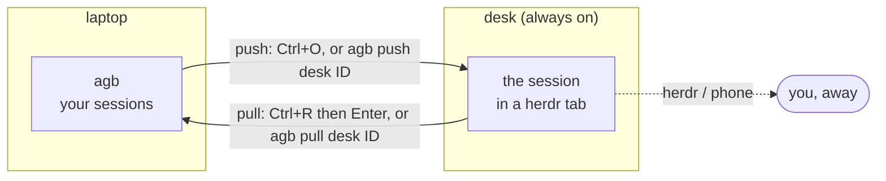
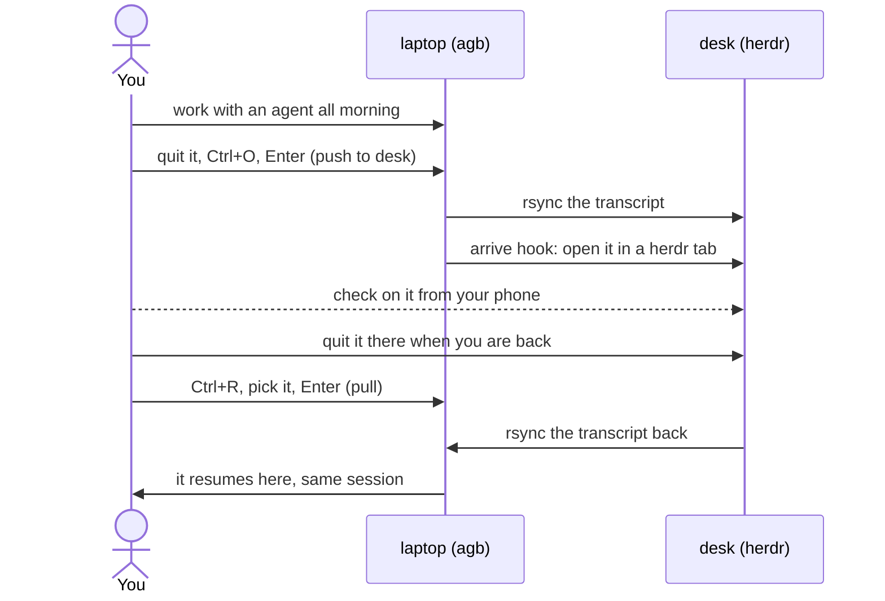
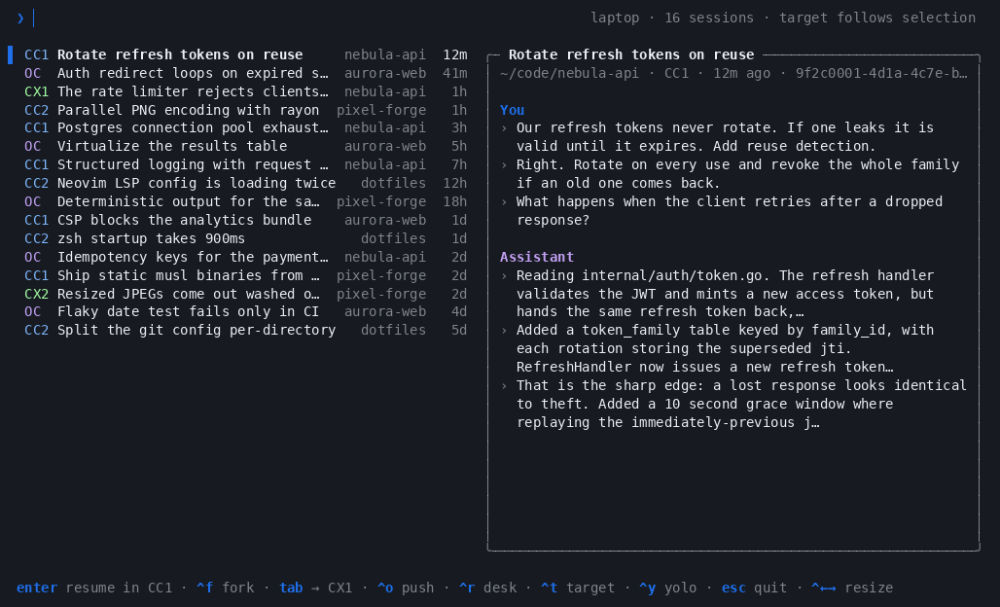

# Pushing and pulling sessions between machines

A Claude Code or Codex session lives on one machine at a time. `agb push` hands
it to another of your machines and `agb pull` brings it back. On the other side
it resumes as **the same session**, with the same id and full history, not as a
seeded copy.



Neither one is a sync. A push copies the session's files to the other machine
and replaces what was there. A pull does the same in the other direction. You
always run the command on the machine you are sitting at.

## A typical day



## In the picker

### Push: Ctrl+O


`Ctrl+O` on a Claude Code or Codex session turns the card into a push panel.
It finds the project on the other machine, checks both sides, and lists what it
will send and what happens once the session is there. Then:

| Key | Does |
| --- | --- |
| `Enter` | Push. Shown only when nothing stops it. |
| `←` `→` | Another machine from `moveHosts` |
| `Ctrl+D` | Another directory there, when the project exists in more than one place |
| `Ctrl+K` | The session is open here: end it (SIGTERM), check again, and push |
| `Esc` | Back to the list |

A line marked `✓` passed, `!` is a note that does not stop the push, and `✗`
stops it.

### Pull: Ctrl+R



`Ctrl+R` switches the list to another machine's sessions. The header reads
`laptop ▸ desk`, and pressing `Ctrl+R` again steps to the next machine and then
back home. Typing still filters the list. `Enter` pulls the selected session
and resumes it here, in the account it belongs to. A session that is still open
over there shows `● open on desk` and cannot be pulled until you quit it there.
`Esc` goes home.

Browsing runs `agb --print --json` on the other machine over ssh, so `agb` has
to be installed there.

## From the command line

```console
$ agb push desk 0c5ddcb6 --dry-run
Push CC2 0c5ddcb6-… to desk
  Herdr setup and patch diagrams
  in ~/phd
copy     ~/.claude-cc2/projects/-home-sergio-phd/0c5ddcb6-….jsonl
copy     ~/.claude-cc2/projects/-home-sergio-phd/0c5ddcb6-…
merge    ~/.claude-cc2/projects/-home-sergio-phd/memory (newer files there are kept)
Note: ~/phd has uncommitted changes to tracked files; commit and push them so the code goes along
Dry run: nothing copied. There, it would resume with:
  cd '/home/sergio/phd' && CLAUDE_CONFIG_DIR='/home/sergio/.claude-cc2' claude --resume 0c5ddcb6-…

$ agb pull desk 0c5ddcb6
```

| Command | |
| --- | --- |
| `agb push HOST ID` | Push the session. `ID` may be a prefix. |
| `agb push ID` | Ask for the host and directory, in plain prompts |
| `agb pull HOST ID` | Pull it. The session does not have to be known here: it is looked up there by id prefix. |
| `--dir DIR` | Another directory on the receiving side |
| `--dry-run` | Check and list, change nothing |
| `--force` | Go ahead even though it is open on this side, or the copy here or there is bigger (see below) |
| `--no-arrive` | Push without running the arrive hook |

## Setting it up

1. **Linux on both machines.** The checks run GNU `stat` and `find`, read
   `/proc`, and copy with `rsync --mkpath`; macOS has none of these as-is.
2. **Same user, same home path on both machines,** and an ssh alias for the
   other one (`ssh desk` works without a password). Both commands check the
   home path and refuse if it differs.
3. **Name the machines** in `~/.config/agentbridge/config.json`. The same file
   can be used on every machine; each one leaves itself out of the list.

   ```json
   "moveHosts": ["desk"]
   ```

4. **Install agb on the other machine too** if you want to browse it with
   `Ctrl+R`. agb is a static binary, so copying `~/.local/bin/agb` over works.
   It has to be on the PATH that `ssh desk 'agb --print'` sees.
5. **Optionally, an arrive hook** that starts the session once it lands:

   ```json
   "arrive": {
     "desk": "p=$(herdr tab create --label {title} --cwd {dir} --no-focus | jq -r .result.root_pane.pane_id) && herdr pane run \"$p\" {resume}"
   }
   ```

   The hook runs on that machine over ssh after the copy. `{resume}`, `{dir}`,
   `{title}` and `{id}` each become one shell word, so leave them unquoted.
   This one opens the session in a new [herdr](https://herdr.dev) tab, where
   herdr and its phone client can see it. agb itself knows nothing about herdr:
   `tmux new-window -d {resume}` works just as well. Without a hook, agb prints
   the `ssh -t` command that resumes it there.

## What stops it, and what is only a note

| Check | Push | Pull |
| --- | --- | --- |
| The session is open on the receiving side | ✗ stop | ✗ stop |
| The session is open on the sending side | ✗ stop (`--force`, or `Ctrl+K` in the picker) | ✗ stop (`--force`) |
| The receiving side's copy is **bigger** | ✗ stop (`--force`) | ✗ stop (`--force`) |
| Project directory, tool or same home path missing on the receiving side | ✗ stop | ✗ stop |
| Account there does not look logged in | ! note | — |
| Uncommitted or unpushed work, or the two checkouts at different commits | ! note | ! note |

**"Open"** means any of three things: Claude Code's own record of a running
session (with the process start time, so a reused pid does not count), a process
holding the transcript file open, or a process started to resume it
(`claude --resume <id>`, `codex resume <id>`). The last one catches a session
that has not got far enough to do either of the others, such as Claude Code
still waiting at its trust prompt.

**"Bigger"** is the one guard against losing work. Transcripts only grow, so a
bigger copy on the receiving side has turns that this one lacks: the session
carried on there. Pull it from there instead of pushing over it. agb compares
sizes and nothing more. It keeps no history, so the copy being sent simply
replaces the other one.

**Code is git's job.** agb copies the conversation, not your working tree. When
the project has uncommitted changes, an unpushed HEAD, or the other checkout
sits at a different commit, you get a note. Commit and push before you go, and
pull on the other side.

## What travels

| | Push | Pull |
| --- | --- | --- |
| The transcript | replaces the copy there | replaces the copy here |
| Claude's sibling folder (tool results, subagents) | ✓ | ✓ |
| Project memory | merged, newer files kept | merged, newer files kept |
| agb handoffs and other transcripts it names by path | ✓, newer copies there kept | — |
| Background tasks it started | ✗, ask the agent to check them again | ✗ |

OpenCode keeps its sessions in a database, so OpenCode sessions do not travel.

## Using herdr on both machines

herdr only sees processes it started itself: a session started with plain
`ssh desk claude …` never shows up in herdr or on your phone. A setup that
holds together:

- Run agents inside herdr on the laptop too. Run `agb` in a herdr pane and
  open sessions from there.
- When something should keep running while you are away, quit it, `Ctrl+O`,
  `Enter`. The arrive hook opens it in a herdr tab on desk, and your phone
  follows it there.
- When you are back, `Ctrl+R`, pick it, `Enter`. It resumes in the pane you
  are in.

## When something goes wrong

| You see | Why | Do |
| --- | --- | --- |
| `agb is not installed on desk` while browsing | `agb --print --json` failed over ssh | Copy `~/.local/bin/agb` to desk, and check that `ssh desk 'command -v agb'` finds it |
| `HOME on desk is …` | The two machines have different home paths | Use the same user and home path on both |
| `the copy is bigger on desk` | The session carried on there | Pull it instead, or `--force` to throw those turns away |
| Pushed, but nothing appears in herdr | No arrive hook, or it failed | `agb push desk ID --dry-run` prints the expanded hook; run it on desk to see the error |
| `open here (pid …)`, but you quit it | Something else still holds it: another terminal, or a crashed process | `ps -fp PID`; `Ctrl+K` in the picker ends it for you |
